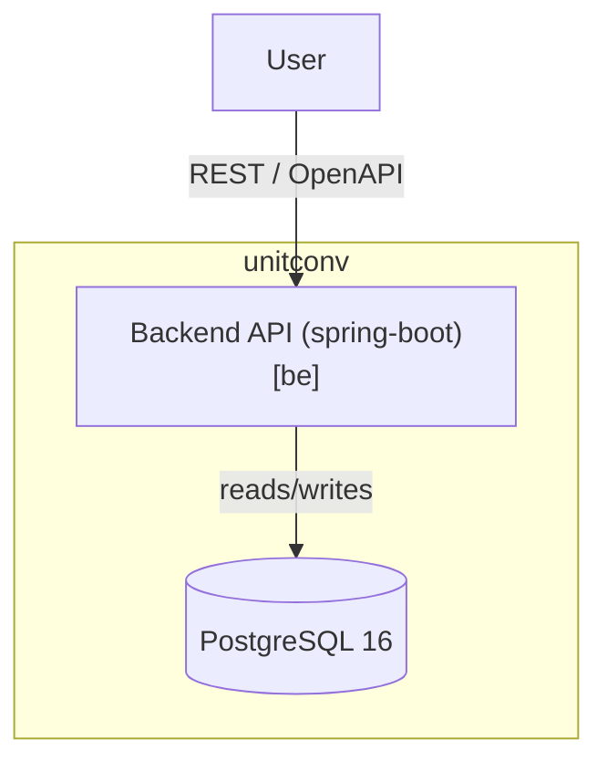
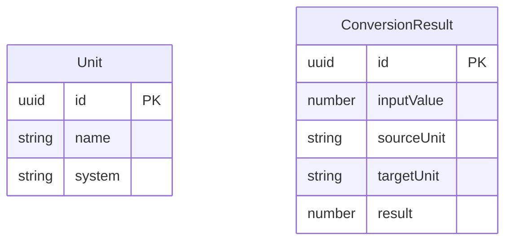

# unitconv - Solution Architecture

**Jira Ticket:** DF-001

## Overview
Measurement conversion web service exposing a Spring Boot REST API supporting metres<->feet, kilometres<->miles, and litres<->gallons with clear validation, persistence, and measurable NFRs.

The service is a small HTTP API with simple validation and low computational needs. Java + Spring Boot enables robust development, well-structured layered architecture, and clear request/response validation (Bean Validation).

## Technology Stack
| Layer | Choice |
|-------|--------|
| Backend | java / spring-boot 3.4.x |
| Datastore | PostgreSQL 16 |

## Repositories
| id | Name | Role |
|----|------|------|
| be | unitconv-backend | backend |

## Container View (C4)

## Data Model

Persisted entities:

DTOs (not persisted):

- **ConversionRequest** — inbound request DTO (value, sourceUnit, targetUnit)
- **ValidationError** — error response DTO (id, message, field)

## API Contract
REST contract defined in `openapi.json` (OpenAPI 3.0.3).

## Components
| Component | Repo | Responsibility |
|-----------|------|----------------|
| REST Controller | be | Expose REST endpoints (/api/convert, /api/units), request/response validation via Bean Validation, error handling via @RestControllerAdvice. |
| Conversion Service | be | Core conversion logic (metres<->feet, kilometres<->miles, litres<->gallons), unit compatibility checks, numeric precision handling, persisting results. |
| Unit Repository | be | JPA repository for Unit entity. Units are pre-loaded at startup (seed data or migration). |
| Conversion Result Repository | be | JPA repository for ConversionResult entity. Stores every successful conversion. |

## Non-Functional Requirements
- **NFR-1 (performance):** p95 latency for POST /api/convert is under 200ms when subjected to 100 concurrent clients issuing requests with valid inputs.
- **NFR-2 (security):** All invalid inputs (non-numeric value or incompatible unit pairs) return HTTP 400 with a JSON body containing a 'message' field describing the error.
- **NFR-3 (reliability):** Error rate for valid conversion requests remains below 0.1% over a 24-hour window under normal load (up to 10k requests/day).

## Architecturally Significant Requirements
- **ASR-1 - Where conversions are executed: client vs server.** Drivers: Need for authoritative, consistent validation and result formatting across all clients; potential future extension to add more unit types or business rules; requirement to return clear validation errors from a single place. Decision: Perform all conversions and compatibility validation on the server-side. Final validation and calculation occur in the backend Conversion Service.
- **ASR-2 - Technology choice for backend.** Drivers: Small, latency-sensitive API with straightforward validation and simple JSON DTOs; goal for rapid implementation and clear request/response validation. Decision: Use Java Spring Boot for the backend to leverage Bean Validation, layered architecture, and a mature ecosystem.