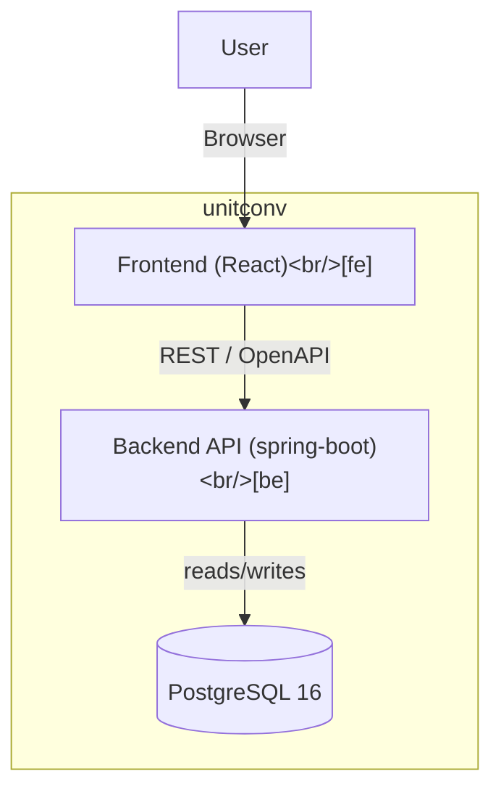
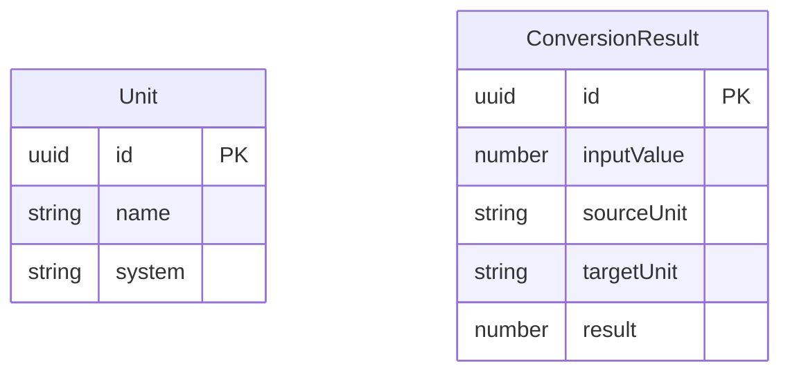

# unitconv - Solution Architecture (Full Stack)

**Jira Ticket:** DF-002

## Overview
Full-stack unit conversion application with a Spring Boot REST backend and a React frontend. The backend handles conversion logic, validation, and persistence. The frontend provides a form-based UI for conversions and displays session-local history.

## Technology Stack
| Layer | Choice |
|-------|--------|
| Backend | java / spring-boot 3.4.x |
| Frontend | typescript / react 18.x |
| Datastore | PostgreSQL 16 |

## Repositories
| id | Name | Role |
|----|------|------|
| be | unitconv-backend | backend |
| fe | unitconv-frontend | frontend |

## Container View (C4)

## Data Model

### Persisted Entities

- **Unit** — represents a supported measurement unit (e.g. metres, feet). Pre-loaded at startup via seed data or migration.
- **ConversionResult** — stores every successful conversion. The id is server-generated (UUID).

### DTOs (not persisted, not in database)

- **ConversionRequest** — inbound request body with fields: value (number), sourceUnit (string), targetUnit (string).
- **ConversionResult response** — the API response maps directly from the persisted ConversionResult entity (id, inputValue, sourceUnit, targetUnit, result).
- **ValidationError** — error response body with fields: id (UUID, always present), message (string, always present), field (string or null — present when the error relates to a specific input field, absent otherwise).

## API Contract
REST contract defined in `openapi.json` (OpenAPI 3.0.3).

| Method | Path | Request Body | Success Response | Error Response |
|--------|------|-------------|-----------------|----------------|
| POST | /api/convert | ConversionRequest | 200 ConversionResult | 400 ValidationError |
| GET | /api/units | — | 200 Unit[] | — |

## Components
| Component | Repo | Responsibility |
|-----------|------|----------------|
| REST Controller | be | Expose REST endpoints (/api/convert, /api/units), request validation via Bean Validation, error handling via @RestControllerAdvice. |
| Conversion Service | be | Core conversion logic, unit compatibility checks, numeric precision handling, persisting results. |
| Unit Repository | be | JPA repository for Unit entity. |
| Conversion Result Repository | be | JPA repository for ConversionResult entity. |
| Conversion Form | fe | React component: numeric input, unit dropdowns (populated from /api/units), Convert button, result display, error messages. |
| Conversion History | fe | React component: displays list of conversions performed in the current session (frontend state only). |
| API Client | fe | Typed HTTP client for calling backend endpoints (fetch or axios). |

## Non-Functional Requirements
- **NFR-1 (performance):** p95 latency for POST /api/convert under 200ms at 100 concurrent clients.
- **NFR-2 (security):** All invalid inputs return HTTP 400 with a ValidationError JSON body.
- **NFR-3 (reliability):** Error rate below 0.1% over 24h under normal load.
