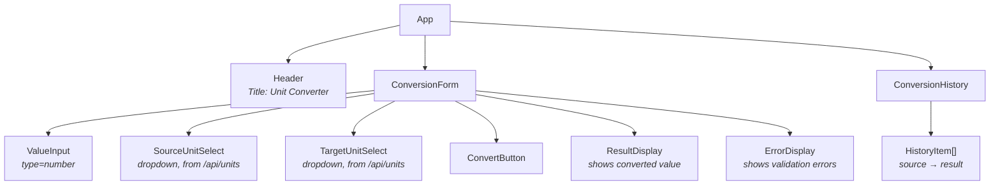
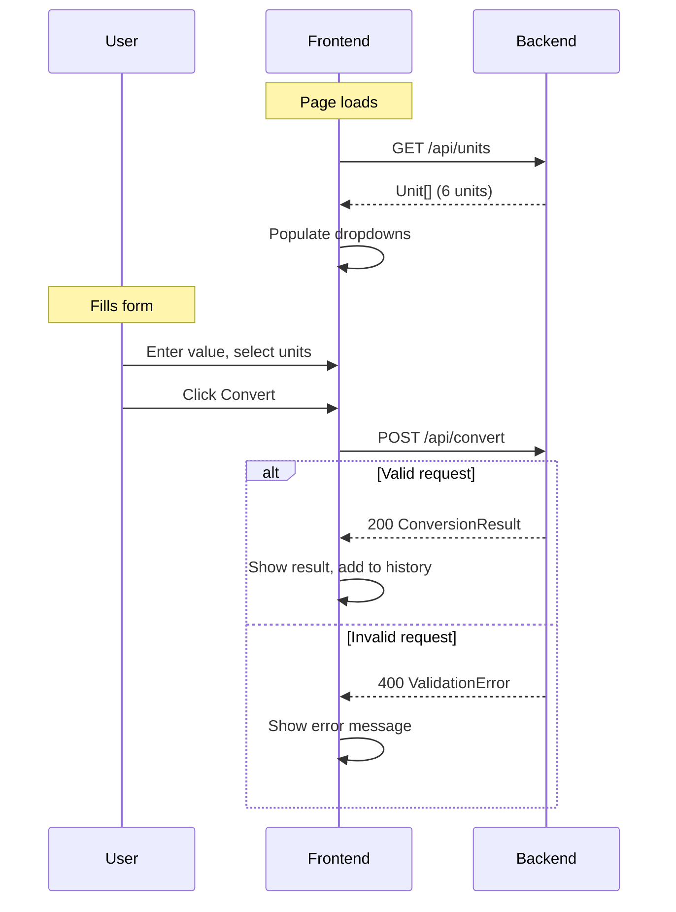

# unitconv — UI Design

## Page Layout

```
┌─────────────────────────────────────────────┐
│  Unit Converter                             │
├─────────────────────────────────────────────┤
│                                             │
│  ┌─────────────────────────────────────┐    │
│  │         Conversion Form             │    │
│  │                                     │    │
│  │  Value:  [_______________]          │    │
│  │                                     │    │
│  │  From:   [▼ Select unit  ]          │    │
│  │                                     │    │
│  │  To:     [▼ Select unit  ]          │    │
│  │                                     │    │
│  │  [ Convert ]                        │    │
│  │                                     │    │
│  │  ┌─────────────────────────────┐    │    │
│  │  │ 1 metres = 3.28084 feet    │    │    │
│  │  └─────────────────────────────┘    │    │
│  │                                     │    │
│  │  (error message displayed here)     │    │
│  └─────────────────────────────────────┘    │
│                                             │
│  ┌─────────────────────────────────────┐    │
│  │        Conversion History           │    │
│  │                                     │    │
│  │  • 1 metres → 3.28084 feet         │    │
│  │  • 5 kilometres → 3.10686 miles     │    │
│  │  • 2 litres → 0.528344 gallons     │    │
│  └─────────────────────────────────────┘    │
│                                             │
└─────────────────────────────────────────────┘
```

## Component Tree



## User Flow


